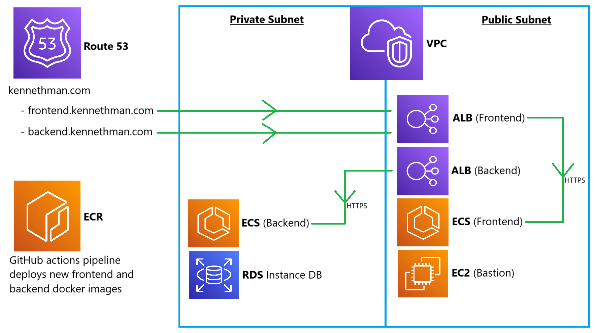

# Puppeteer Web Scraping
### Uses the puppeteer library https://pptr.dev/ to scrape betting odds from popular bookmaker sites

# AWS Architecture

- ### A `NAT` gateway is used to allow the backend container in a private subnet to initiate communication with the backend `ECR` registry
- ### A Bastion `EC2` instance is used so that I can access the `RDS` Instance Database from my local machine via an `SSH` tunnel
	- ### E.g. Local machine -> `EC2` Bastion -> `RDS` Instance DB
- ### I have setup authentication using cookies, so the `Application Load balancers` must listen on `HTTPS` port 443, in order to be able to send a cookie cross-subdomain (Backend to Frontend)

# Monorepo Architecture
### `NPM Workspaces` is used to re-use common functionality from `<rootDir>/shared`, between the following directories:
- ### `<rootDir>/scripts`
- ### `<rootDir>/backend`
- ### `<rootDir>/frontend`

<br>

# How to run locally
## Start the postgres server
### 1. Install and Open `Docker Desktop` https://docs.docker.com/engine/install/ or make sure the docker engine is running on your machine

### 2. Go to the `postgres` directory
```
 cd postgres
```

### 3. Create the docker image
- ### In our example, we will use `postgresdb` as the image name
```
docker build -t postgresdb .
```

### 4. Run the docker container
- ### In our example, we are using values from `<rootDir>/backend/config/development.json` `POSTGRES_PASSWORD`
```
docker run --name postgresdb-container -p 5432:5432 -e POSTGRES_DB=PuppeteerWebScrapingDB -e POSTGRES_USER=Kenneth -e POSTGRES_PASSWORD=abc123 -d postgresdb
```

- ### ***Note:*** If you have already ran the container before, open `Docker Desktop` and click the `play` button on the container or run...
```
docker start [CONTAINER_ID]
```

<br>

## Start the Backend API server
### 1. In the project root directory,  install dependencies
```
npm i
```

### 2. Go to the backend directory
```
cd backend
```

### 3. Make sure the postgres server is running, then start the server
```
npm start
```

<br>

## Start the Frontend server
### 1. In the project root directory,  install dependencies (If you haven't already)
```
npm i
```

### 2. Go to the frontend directory
```
cd frontend
```

### 3. Start the server
```
npm start
```

<br>

## (OPTIONAL) - Query the postgres db using E.g. `pgAdmin`
### 1. Open `pgAdmin`

### 2. Click `Add New Server`

### 3. Under the `General` tab, Type in any name you want for the server

### 4. Under the `Connection` tab,
- ### `Host name/address` = `localhost`
- ### `Username` = (The `POSTGRES_USER=...` that was given with the `docker run` command previously)
- ### `Password` = (The `POSTGRES_PASSWORD=...` that was given with the `docker run` command previously)