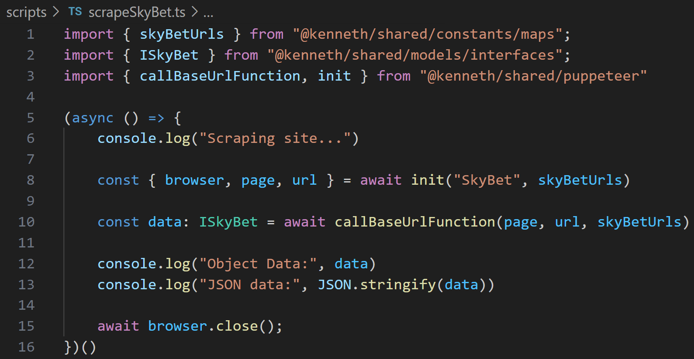
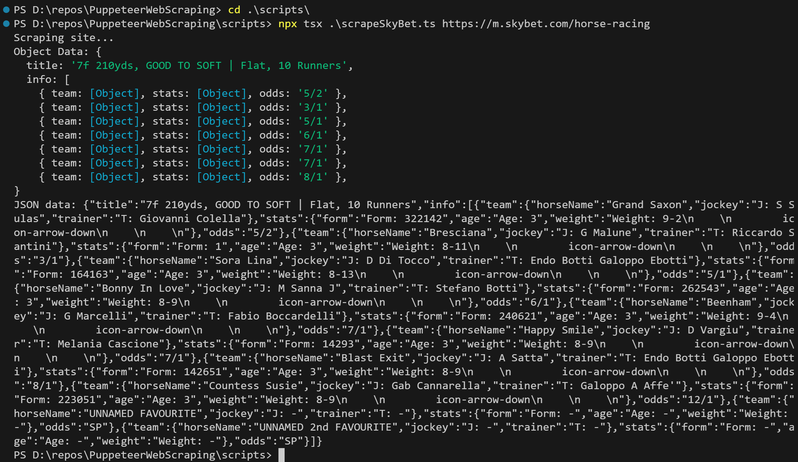

# Scripts
- ### To scrape odds for an event from the following bookmaker sites:
	- ### https://m.skybet.com/

<br>

# ▶️ Run a script
### 1. Install dependencies in the project root directory (If you haven't already)
```
npm i
```

### 2. Make sure you're in the `scripts` directory
```
cd scripts
```

### 3. Execute the script file with `npx tsx`
- ### E.g.
	- ### Scripts require the Url of a bookmaker site page, which is passed as a command argument
```
npx tsx scrapeSkyBet.ts https://m.skybet.com/horse-racing
```

<br>

# ▶️ Demo
- ### In the `rootDir/scripts` directory, and executing `npx tsx scrapeSkyBet.ts https://m.skybet.com/horse-racing`


