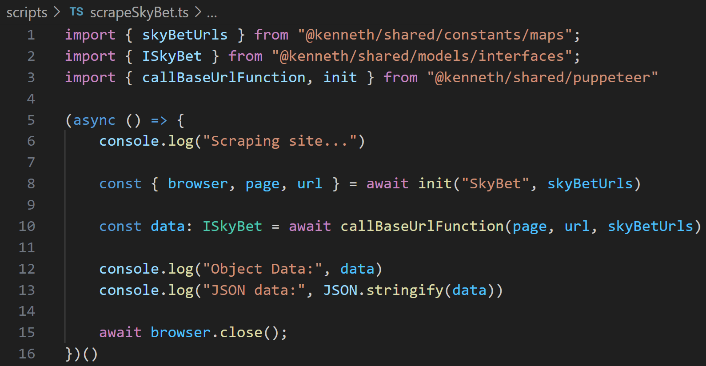
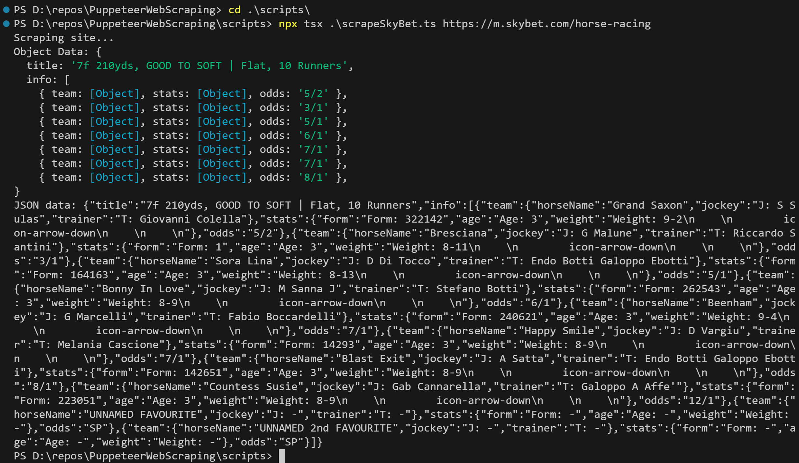

# Scripts
- ### To scrape odds for an event from the following bookmaker sites:
	- ### https://m.skybet.com/

- ### The Url that can be passed into a script or the backend `/odds` endpoint is determined by a `map` data structure in `<rootDir>/shared/constants/maps.ts`
	- ### The reason for this mapping is to cover the case in the future where a Url is dynamic (e.g. with unique id) and not a static Url like `https://m.skybet.com/horse-racing`
	- ### Each page can have a different layout of elements that changes which parents and children elements need to be selected
	- ### So, as long as a Url contains a common base Url, the same function will be called to scrape that page

<br>

# ▶️ Run a script
### 1. Install dependencies in the project root directory (If you haven't already)
```
npm i
```

### 2. Go to the `scripts` directory
```
cd scripts
```

### 3. Execute the script file with `npx tsx`
- ### E.g.
	- ### Scripts require the Url of a bookmaker site page, which is passed as a command argument
```
npx tsx scrapeSkyBet.ts https://m.skybet.com/horse-racing
```

<br>

# ▶️ Demo
- ### In the `<rootDir>/scripts` directory, and executing `npx tsx scrapeSkyBet.ts https://m.skybet.com/horse-racing`

- ### If after 30 seconds, the selectors cannot be found and data cannot be scraped, an error is thrown


