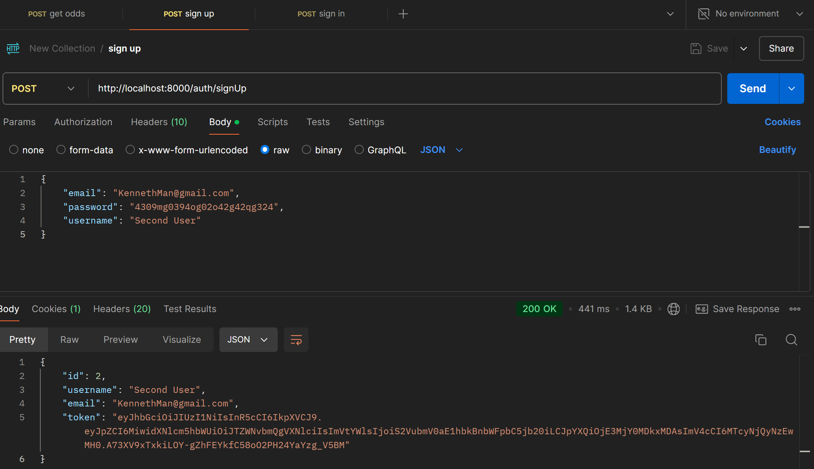
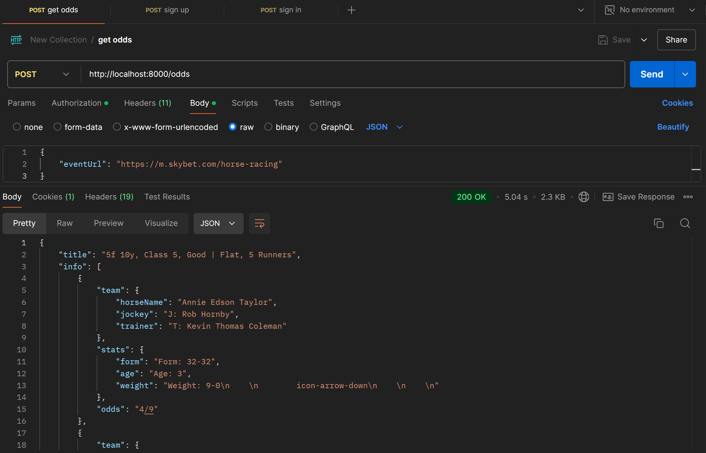

# API
- ### There are currently 3 endpoints
	- ### `/auth/signUp`
		- ### Requires a request body with the following fields
			- ### `username`
			- ### `password`
			- ### `email`
		- ### Upon successful signup, adds the data row into the postgres database
		- ### Signs a JWT to be used in the `/odds` endpoint

	- ### `/auth/signIn`
		- ### Requires a request body with the following fields
			- ### `password`
			- ### `email`
		- ### Signs a JWT to be used in the `/odds` endpoint

	- ### `/odds`
		- ### Requires a request body with the following fields
			- ### `eventUrl`
		- ### Is a protected endpoint which requires the `Authorization` header to be set to `Bearer [TOKEN]`

 

# ▶️ Demo
- ### Calling the `auth/signUp` endpoint, which creates a user in the postgres database and sends a JWT

- ### Calling the `/odds` endpoint using the JWT in the `Authorization` header so only authorized users can access the scraped data

- ### If after 30 seconds, the selectors cannot be found and data cannot be scraped, an error is thrown
